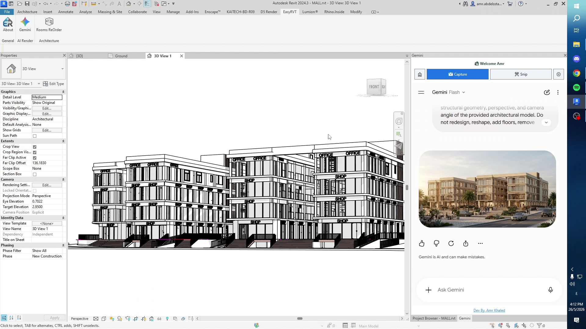

# 🌌 Gemini Inside Revit: NanoBanana 2 
Bring the power of **Google Gemini AI** directly into your **Autodesk Revit** workspace with a seamless dockable side panel. 

## 📥 Download
Click the button below to download the easy setup installer:

  

---

## 🛠️ How to Install
1. **Download:** Click the download button above to get the `Gemini Inside Revit Add-in.exe` file.
2. **Run the Installer:** Double-click the downloaded file and follow the quick setup wizard. It will automatically detect your Revit versions and place the add-in in the correct folders.
3. **Launch Revit:** Open your project. You will see a new `EasyRVT` tab on your ribbon toolbar. Click this tab to find the `Gemini` button.
4. **Dock the Panel:** Once opened, you can drag, pin, or dock the sidebar anywhere on your screen just like your native Properties or Project Browser palettes.

---

## 🚀 Key Features for Designers

**📸 One-Click Viewport Capture**
* **Instant Sharing:** Instantly capture your active 2D or 3D Revit view and send it straight into the Gemini prompt box without needing to manually export, save, or drag images.

**✂️ Smart Snipping Tool**
* **Focus on Details:** Don't want to show the whole screen? Use the built-in Snip tool to draw a box around a specific floor plan area, structural detail, or 3D element to ask the AI targeted questions.

**⚙️ Simple Settings Menu**
* **Image Quality:** Control your output resolution settings easily from the dashboard.
* **Auto-Archive:** Automatically keep a local log of all your visual captures securely in your `Documents\Gemini_Revit_Captures` folder.
* **Clean Backgrounds:** Toggle an option to automatically force a clean white background during captures for clearer visual communication.

**🔒 Automatic Theme & Login Sync**
* **Seamless Experience:** The tool automatically syncs with Gemini's Light/Dark mode and securely remembers your Google login status.

**📥 Frictionless In-App Updates**
* **Safe Background Updates:** When a new update is ready, a banner will let you know. Click "Download & Prepare," and the tool will safely handle the installation in the background the moment you close Revit.

---

## 💡 Important User Notes
* **Account Required:** You will need to log into a standard Google account inside the panel to interact with Gemini.
* **100% Model Safe:** This tool is purely a visual communication and analysis assistant. It **never modifies or alters** your actual Revit model geometry, parameters, or project data.
* **Compatibility:** Fully supports **Revit 2024 to 2026**.

---
Developed by **Amr Khaled (MeroZy)** *Computational Architect & AEC Developer*
